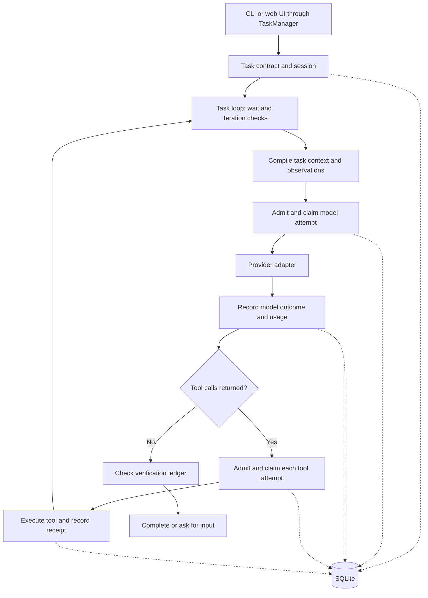

# Lattice

Lattice runs a coding model against a project on your machine. It gives the
model tools to inspect files, make edits and run commands, and keeps a local
record of the work so you can inspect results and continue unfinished tasks.

**Status:** publicly available, actively developed, version `0.0.0`.
Benchmarking and further validation are still in progress. This release makes
no comparative performance claims.

[Installation](#installation) · [Quick start](#quick-start) ·
[Runtime architecture](#runtime-architecture) · [Current limitations](#current-limitations)

## What Lattice is

An **agent harness** is the software around a model that turns its tool
requests into actions. In Lattice, the model proposes what to do; the runtime
checks permissions and budgets, executes tools, records their results and
supplies observations for the next turn. You provide the project, task and
model endpoint through the CLI or local web interface.

Lattice is useful when you want to see what a coding agent actually did:
which commands ran, which edits were made, what verification reported and
what remains uncertain after an interruption.

## Why Lattice exists

A tool-using agent has more state than its conversation. Files change,
commands can outlive a model turn, requests can time out after dispatch,
and restarting can otherwise lose track of work already attempted.

Lattice records execution separately from the model's text. It checks file
versions before replacing content, records uncertain outcomes explicitly,
and retains task state and budget accounting across runs. These mechanisms
make work inspectable; they do not establish that a model's answer is correct.

## How a Lattice run works

1. **Create the task.** Lattice records the objective, workspace, acceptance
   criteria, permitted operations and limits in a task contract. A session
   groups the task's runs, including later continuations.
2. **Build the request.** The loop combines task instructions and observed
   tool results, then admits and records a model attempt before sending it.
3. **Execute requested tools.** Tool calls are processed sequentially. Each
   goes through admission and a second permission check before execution.
   Results are recorded and supplied to the next model turn.
4. **Check the outcome.** When the model returns no tool calls, the loop
   consults verification evidence. It finishes if the configured checks
   pass, or asks for input if completion remains unverified. Errors and
   exhausted limits can block the task; waiting pauses model calls.
5. **Inspect or continue.** The CLI and UI expose persisted task information.
   Eligible unfinished tasks can start another run under the same session
   and remaining budget.

## Runtime architecture

The TypeScript runtime runs in Node.js. The CLI and the web server's
`TaskManager` both call `runTaskLoop`; the React frontend communicates with
the server over HTTP and Server-Sent Events (SSE).



Denied actions, failures, interruption and stable waits also provide exit
paths. The diagram shows the main execution cycle, not every state transition.

### Task contracts, admission and execution

A `TaskContract` holds the objective, workspace scope, acceptance text,
obligations, grants, restrictions, expiry and provider/model fields. Revisions
identify contract changes. A **grant** lists permitted operations and targets,
with call/token limits and optional expiry.

Before a model or tool invocation, `admitDurable` checks authority and budget
availability, then commits an **intent** (the proposed action), an **attempt**
(the execution record) and a budget reservation. `claimDurable` checks the
executor generation (the current owner instance), contract revision and grant
again before dispatch. A **receipt** records a confirmed, failed or unknown
outcome and settles or retains the reservation.

Model calls consume the model-attempt and token budget. Tools have their own
attempt records but do not consume model-call units. The loop also has an
iteration limit and suppresses a third identical tool request within an
activation. Token reservations are accounting controls, not a guaranteed
upper bound on what a provider can generate or bill.

The authority evaluator supports typed deny rules. Free-text prohibitions
and UI “forbid” steering are guidance, not enforceable command policies.
Provider/model checks exist in the evaluator, but the current durable loop
does not pass those identities as typed authority fields; endpoint selection
should not be treated as a complete provider security boundary.

### Context and model requests

`compileSurface` renders a fixed instruction kernel and task fields:
objective, acceptance criteria, grants, prohibitions, pending obligations,
uncertain effects, human decisions, observed versions and the latest error.
It selects evidence within a character allowance, names omitted items and
refuses to omit required task fields when those alone exceed the allowance.

This is basic context construction. The loop also appends its accumulated
evidence as separate messages, so the compiler allowance does **not** bound
the complete provider payload. There is no semantic retrieval store,
learned memory system or automatic conversation summarization. Tool-result
expansion handles are held in memory and do not survive restart.

`ProviderAdapter.complete` accepts messages and tool schemas and returns text,
tool calls and usage. The implemented network adapter uses non-streaming
OpenAI-compatible Chat Completions, with request timeouts and abort support.
It sends once per attempt and does not retry internally. The runtime records
provider failures and uncertainty; it has no general retry/backoff policy.
A scripted fake provider supports deterministic tests without a model service.

### Tools and workspace boundaries

The tool registry exposes five tools. JSON arguments are decoded as objects;
each executor performs its own argument and precondition checks.

| Tool | Current behavior |
| --- | --- |
| `search` | Literal path/text search with file and match limits, skipped-file information and incomplete-result reporting. |
| `read` | Line-based reads, content versions and expansion handles for retained results. |
| `edit` | Create, literal replace, delete and rename. Existing-file changes require an expected version; replacement requires one exact match. |
| `exec` | Executable/argument or explicit shell execution, bounded output, timeout and process-tree termination attempts. |
| `process` | Spawn, poll, send input and stop through handles associated with a supervisor and generation. |

Create and replace write through a temporary file in the same directory and
rename it into place. Replacement rechecks content before the write. This
helps detect stale edits, but does not lock out external editors or provide
multi-file transactions.

Filesystem tools and command working directories use canonical path checks
to reject workspace escapes through traversal or symlinks. Search skips
symlink entries. Child processes receive a small environment allowlist plus
explicit per-call additions, rather than the runtime's full environment.

**The `local-trusted` execution mode is not an OS sandbox.** Commands run
with your user privileges and can access files or networks beyond their
working directory. Path checks and environment filtering do not contain
arbitrary code executed by those commands.

### Persistence, inspection and recovery

Lattice uses `node:sqlite`, with WAL mode, `synchronous=FULL` and versioned
transactional migrations. The database stores contracts, run manifests,
intents, attempts, reservations, receipts, task events, verification records,
waits and model-usage revisions. A single owner process claims the data
directory; a second live owner is refused.

These records explain what was attempted and what was observed. They are
not a complete verbatim transcript: model text and tool output can be
truncated, some UI events are transient, and records are not cryptographically
tamper-proof. Usage distinguishes observed, estimated and unknown quantities;
`export` writes a local JSONL usage snapshot, not a full execution archive.

Resumption opens a new run under the existing session and contract budget.
The resume gate rejects missing contracts/runs/workspaces, expired contracts
and completed or cancelled tasks. It also reports uncertain attempts, file
changes since recorded versions, pending obligations and prior verification.
The CLI continuation builds task context from that report; UI continuation
currently rebuilds a smaller surface from the contract.

Recovery invalidates admitted attempts that were never claimed. Claimed
attempts without receipts become `UNKNOWN`. Admission rejects an equivalent
pending/unknown action key; edit reconciliation helpers compare recorded and
observed file versions. This is not general exactly-once execution or automatic
recovery of every external effect. Process handles cannot be restored into a
new supervisor after restart.

Wait records cover process, input, deadline and manual conditions. The loop
checks waits before model admission, so stable waiting uses no model calls.
Explicit wake observations are persisted; level wakes deduplicate by task,
source and cursor. These are coordination primitives, not a background task
scheduler: recording a wake does not itself start another run, and closing
the app stops runtime observation.

### Verification and completion

`VerifyLedger` keeps the latest command result. Normal completion requires
exit code zero, recognized test counts, zero reported failures and no timeout.
The parser currently recognizes TAP-style `ok`/`not ok` lines and Node test
runner spec-summary lines. Arbitrary test-runner output may remain unknown.

On the CLI, `--verify` and repeated `--verify-arg` flags register an exact
executable/argument match. They **do not launch the command automatically**:
the model must request the matching `exec` call. In the web runtime, every
`exec` result updates the verification ledger.

Acceptance criteria are task text, not independently executable predicates.
The current verifier does not prove every criterion, bind a pass to the
latest workspace revision, require nonzero/non-skipped tests, or protect
against modified tests. A successful check is useful evidence, not a general
correctness guarantee.

### Web interface

The local Node HTTP server serves the React app, accepts commands and exposes
task snapshots, retained tool details, sessions and provider configuration.
SSE supplies live updates; the server supports event replay from a bounded
buffer or a request to reload a snapshot. API access uses a session cookie,
with loopback Host/Origin checks for the relevant requests.

The UI can create/start tasks, request a stop, record steering, resume work,
inspect tool output and edit previews, and configure providers. Stop requests
abort model requests and are checked by the loop; immediate cancellation of
an already-running command is not guaranteed. Provider keys entered in the
UI are held in server memory; non-secret defaults are saved separately.

Composition epochs version the selected provider, model and tool definitions;
digest helpers identify that configuration. The server records selected
routes. Per-request bindings are not wired into the task loop, and selecting
a model during an active run does not replace its active adapter. Treat live
switching and composition enforcement as incomplete.

## Current capabilities

- CLI and local web task execution with five built-in tools.
- Version-checked file edits and workspace path validation.
- Durable action records, model usage accounting and local JSONL export.
- Manual continuation of eligible tasks with retained session and budget.
- Command-result verification and explicit blocked, input-needed and waiting states.
- OpenAI-compatible hosted/local endpoints, UI model discovery and connection checks.

## Current limitations

Lattice remains under active development. Architecture and UI may change;
full comparative benchmarks are still being prepared. The current release
should not be interpreted as a final performance or reliability claim.

- Verification, context limits, recovery and live model switching have the
  limits described above.
- No multi-agent delegation, workflow DAG scheduler, hardware-aware router,
  cross-model KV-cache transfer or durable semantic memory is implemented.
- `local-trusted` commands are not sandboxed. There is no general prompt-injection
  firewall or network-egress policy.
- The CLI returns on stable WAIT and closes its process supervisor. Manual
  continuation does not restore live process handles.
- CI is configured for Linux and Windows on Node 22.13.0 and 24.x. This is
  not a claim of validation on every platform; macOS support is unvalidated.
- Process-crash recovery tests do not establish power-loss durability.

## Installation

Requires **Node.js >= 22.13.0** and **npm**. The runtime uses built-in SQLite;
there is no native-addon build step. Git is needed for the clone command
below, but not for running an installed package. A browser is optional for
CLI use. Hosted providers may require their own account and API key.

Build from the [public repository](https://github.com/Elliot509/LatticeHarness-Candidate):

```sh
git clone https://github.com/Elliot509/LatticeHarness-Candidate.git
cd LatticeHarness-Candidate
npm ci
npm run build
node dist/cli/main.js status
```

To install the CLI globally from that checkout, **build before packing**:

```sh
npm pack
npm install -g ./lattice-harness-0.0.0.tgz
lattice status
```

The package is named `lattice-harness` and supplies the `lattice` executable.
It packages `dist/`, package metadata, README and MIT license; source files,
tests and fixtures are not included. The steps above do not depend on npm
registry publication. In a source-only checkout, replace `lattice` in the
examples below with `node /path/to/checkout/dist/cli/main.js`.

## Quick start

For an OpenAI endpoint, make `LATTICE_API_KEY` available in the current shell.
Use your provider's model identifier. This example assumes the project uses
Node's test runner; adjust the task and exact verification command to your
project:

```sh
cd /path/to/your/project
lattice run --task "Fix the failing tests, then run node --test --test-reporter=tap using exec with executable node and those exact arguments." \
  --accept "project test suite passes" \
  --provider openai --model "<model-id>" \
  --verify node --verify-arg --test --verify-arg --test-reporter=tap
```

The verification command must be requested by the model as described above.
Without matching verification evidence, a text-only response ends in ASK.
`run` exit codes are `0` for normal verified completion, `2` for ASK,
`3` for ESCALATE, `4` for stable WAIT and `1` for operational errors.

To create and inspect tasks in the web UI:

```sh
lattice
# Or choose the workspace and port without opening a browser:
lattice ui --workspace /path/to/project --port 4311 --no-open
```

The server binds loopback and prints its URL. Only one process can own the
same data directory, so stop the UI before running another executing CLI
against that directory.

## Provider configuration

Presets are `openai`, `openrouter`, `gemini`, `abacus`, `local` and `custom`.
They use the same Chat Completions adapter; a preset is endpoint metadata,
not a separately validated native API implementation. Local/custom tool
calling depends on the server and model.

- **CLI:** `--provider`, `--model` and optional `--base-url` select the route.
  Only the `openai` preset reads `LATTICE_API_KEY`. Other CLI presets need an
  explicit base URL and do not read a provider-specific key. Use the UI for
  authenticated non-OpenAI presets.
- **UI:** configure the provider, model, endpoint and key in settings. Keys
  must be supplied again after the server restarts. Model discovery and
  connection testing query the endpoint's `/models` API; they do not test
  inference or tool-calling quality.
- **Status:** `LATTICE_PROVIDER` and `LATTICE_MODEL` populate `lattice status`.
  “Ready” means both names are configured, not that credentials or connectivity
  were tested. `lattice run` still requires explicit `--model`.

For an unauthenticated local OpenAI-compatible server:

```sh
lattice run --task "Inspect the project" --provider local --model "<model-id>" \
  --base-url http://127.0.0.1:8080/v1
```

## CLI reference

The brackets below indicate optional arguments:

```text
lattice --help
lattice --version
lattice status [workspace] [--json] [--workspace <path>] [--data-dir <path>]
lattice run --task <objective> --model <id> [--provider <id>] [--base-url <url>]
  [--accept <criterion> ...] [--verify <exe>] [--verify-arg <arg> ...] [--max-iterations N]
lattice sessions [--json]
lattice resume <taskId> [--json]
lattice run --resume <taskId> [--verify <exe>] [--verify-arg <arg> ...]
lattice export --session <id> --out <path>
lattice wake <taskId> --source <s> --cursor <c> --observation <text> [--wait <id>] [--level]
lattice ui [--workspace <path>] [--port <n>] [--no-open]
```

`resume` evaluates the gate and can open a continuation run; it does not invoke
the model. `run --resume` executes the continuation. Use the original workspace
and repeat the verification flags, which are not stored as CLI configuration.
`sessions` lists tasks; `export` sends nothing over the network.

`--workspace` and `--data-dir` are global options. Commands accepting a
positional workspace must not also receive `--workspace`.

## Optional Agent Index reporting

Agent Index reporting is separate from task execution and disabled by default.
The [public Lattice listing](https://aiworthusing.com/agent-index/lattice)
is not a comparative benchmark result.

```text
lattice index status [--json]
lattice index setup --agent-id <id> [--days N] [--agentsview <path>]
  [--client <path>] [--python <path>] [--credential-file <path>] [--enable]
lattice index report [--dry-run]
lattice index disable
```

This integration requires Python 3, an `agentsview` build with Lattice support,
the compatible Agent Index client and reporting credentials. Setup validates
prerequisites and writes local configuration. `--enable` enables reporting in
that configuration; it does not install a recurring OS scheduler. Registration
and scheduler installation remain separate steps. Reporting aggregates daily
model token counts rather than prompts, patches or tool transcripts.

## Local data and privacy

The database is `lattice.db` in `--data-dir` or `$LATTICE_DATA_DIR`. Defaults
are `$XDG_DATA_HOME/lattice` (otherwise `~/.local/share/lattice`) on Linux and
`%LOCALAPPDATA%\Lattice` on Windows. Non-secret UI provider defaults live in
`lattice.product.json`; optional reporting has separate state.

Model requests send task text, tool schemas and observed content to the
configured endpoint. Provider discovery also contacts that endpoint, and
commands executed in a workspace can make their own network requests.
Optional reporting adds its own external communication.

Provider keys are kept separate from product configuration, and usage export
checks for secret-shaped data. These checks are not universal redaction:
workspace content and command output can contain sensitive information and
can be retained or passed to the model. See [SECURITY.md](SECURITY.md).

## Development

```sh
npm ci
npm run typecheck
npm run lint
npm run build             # TypeScript runtime + bundled React UI
npm test                  # unit, integration and browser test files
npm run test:unit
npm run test:integration
npm run pack:test         # package inspection and isolated install smokes
```

Tests use scripted providers and local fixtures for runtime behavior, authority,
path checks, recovery, migrations and HTTP/UI flows. Browser tests need
Chromium; the external Agent Index chain needs its compatible helper tools.
Those paths are skipped when prerequisites are absent.

For source navigation, start with `src/cli/run.ts` and `src/server/tasks.ts`,
then `src/runtime/loop.ts`. Admission and receipts live in
`src/runtime/effects.ts`, context construction in `src/context/compiler.ts`,
tool registration in `src/tools/registry.ts`, and resumption in
`src/runtime/continuity.ts`.

## License

MIT — see [LICENSE](LICENSE).
