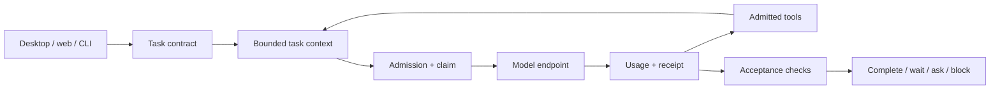

# Lattice

Lattice is a local agent harness: choose a project, describe a task, connect a
model, and inspect the files, commands and results behind its answer. The
runtime keeps task history and usage in SQLite on your machine.

**Development prerelease · version 0.0.0.** Lattice is experimental. There is
no verified public installer or download for this source revision. Internal
engineering bundles are distinct from a supported, signed release.

[Getting started](#getting-started) · [Installation](#installation) ·
[How it works](#how-it-works) · [Limits and security](#limits-and-security) ·
[Development](#development)

## What you can do

- Inspect files and directories, make version-checked edits, and run project commands.
- Use an OpenAI-compatible hosted or local model endpoint; discover model IDs
  when its API supports listing, or enter an ID manually.
- Follow activity, inspect retained output, send guidance, request a model
  change, and stop an active task.
- Verify a simple filesystem objective or a coding test result, with explicit
  waiting, input-needed, blocked, completed and cancelled states.
- Close and reopen retained history, and continue eligible unfinished work
  under its existing contract and remaining limits.

Lattice does not supply a model subscription, project toolchains or guaranteed
model correctness. Commands run with your user privileges.

## Installation

### Desktop engineering bundles

A maintainer can provide a private Linux x64 TAR or Windows x64 ZIP with a
pinned Electron runtime included. Starting that application requires no
system Node, npm, Git, Python or Docker. Commands requested for your project
may still require those tools.

| Environment | Engineering route | Qualification |
| --- | --- | --- |
| Arch / Archcraft | Extract the complete TAR; run `./lattice-p0` as your normal desktop user. Optional `sh install-desktop.sh` adds a user menu entry. | Current-host engineering validation; no formal Arch support claim. |
| Ubuntu 24.04 | Extract the TAR. Where Chromium sandbox policy requires it, run `sudo sh install-ubuntu.sh` once, then launch normally from the menu. | Setup installs a new root-owned whole-app prefix and sandbox helper. Current sprint changes require a fresh guest regression. |
| Windows 11 x64 | Extract the complete ZIP to a writable directory; double-click `Lattice.vbs`, keeping `app` beside it. The CMD launcher is for diagnostics. | Unsigned private engineering artifact; current sprint changes require a fresh Windows regression. |

The Ubuntu setup refuses to overwrite an existing installation. It does not
disable the sandbox or modify global AppArmor/kernel settings. Never set a
privileged sandbox helper inside a user-writable application tree.

Existing private archives predate this reliability sprint. They do not
establish that the new source changes have been packaged or tested on all
three systems. See [portable instructions](desktop/PORTABLE.md) for the bundle
layout, sandbox setup, data directories and removal.

The [Candidate repository](https://github.com/Elliot509/LatticeHarness-Candidate)
was private when inspected on 2026-10-08 and had no published GitHub releases.
No public download button or registry installation is offered here.

### Run from an existing source checkout

Requires Node.js **22.13.0 or newer** and npm. Git is needed only to obtain a
checkout by cloning. A desktop graphical session is needed for Electron;
a browser is needed for the web UI. SQLite is built into Node.

```sh
npm ci
npm run build
node dist/cli/main.js ui --workspace /path/to/project
```

These are developer instructions, not a one-click consumer installer.
For a desktop source launch after building:

```sh
node_modules/.bin/electron dist/desktop/main.cjs
```

Use the native project chooser before starting work. Do not select your whole
home directory or a drive root as the task's project.

## Getting started

1. Open Lattice and choose **Pasta / Escolher projeto**. Select a bounded
   project containing only the work you intend to authorize.
2. Open **Modelo / Configurar**. Choose the provider and endpoint. OpenRouter
   is a preset; use the actual model ID returned by its API or supplied by
   your provider. No Muse model identifier is hardcoded.
3. Enter the key in the session credential field and choose **Configurar
   chave**. The field clears; the key stays in backend memory for that
   provider and endpoint until the app closes.
4. List/search models when available, or enter the exact ID manually. Choose
   **Usar este modelo**. Listing proves API discovery, not inference quality
   or tool support. No universal XHIGH support is assumed.
5. Describe the task. For a first controlled task, try **Create directory
   Muse** inside a disposable project. Optional call/token limits are
   available before starting.
6. Follow the objective, activity and result. A successful command alone is
   not proof that the task's criteria were satisfied. Inspect errors and
   uncertain effects before repeating work.
7. Reopen a task from the session list to inspect retained history. Keys must
   be entered again after closing the app. **Retomar** continues eligible
   unfinished work; it does not reset its budget or replay a confirmed action.

Use **Interromper** to request a stop. Cancellation waits for supervised
process cleanup; uncertain cleanup is reported rather than presented as success.

## How it works

The Electron shell owns a sandboxed renderer and a backend utility process.
The React UI communicates with the backend through authenticated loopback HTTP
and SSE. The CLI uses the same task loop. SQLite stores contracts, run
manifests, intents, attempts, reservations, receipts, events, waits and usage.


```mermaid
flowchart LR
  UI[Desktop / web / CLI] --> Contract[Task contract]
  Contract --> Context[Bounded task context]
  Context --> Admission[Admission + claim]
  Admission --> Model[Model endpoint]
  Model --> Receipt[Usage + receipt]
  Receipt --> Tools[Admitted tools]
  Tools --> Context
  Receipt --> Acceptance[Acceptance checks]
  Acceptance --> Result[Complete / wait / ask / block]
```

| Tool | Observation or effect |
| --- | --- |
| `search` | Literal text/path search, including directories. Scope, exclusions and limits qualify absence claims. |
| `read` | Versioned line snapshots, bounded byte ranges and expiring expansion handles. Oversized or omitted content is explicit. |
| `edit` | Create, exact single-match replace, delete and rename. Existing content requires its expected version. Both rename targets require authority. |
| `exec` | Explicit executable/argv or shell/command forms; malformed mixed arguments fail before spawn. Output and command time are bounded. |
| `process` | Spawn, observe, send and stop through owner-bound handles, with bounded buffers and capacity. Handles do not survive restart. |

Model requests bind the actual provider, model, endpoint, tool surface,
contract revision and payload digest before dispatch. Model changes remain
pending until a subsequent request incorporates them. Earlier run manifests
retain their composition. Guidance is acknowledged after incorporation into
a bound request; it cannot retroactively change an in-flight request.

Context protects the objective, acceptance, authority and unresolved effects.
Recent observations fit a character allowance; older omitted evidence remains
in durable records. There is one evidence path in the request, with an omission
notice. This is not semantic memory or automatic summarization. The current
baseline encodes tool observations as text, rather than a complete native
assistant/tool conversation protocol. Tool schemas add payload beyond the
text-context allowance; that allowance is not a provider token-window guarantee.

### Completion

The supported acceptance vocabulary is deliberately small:

- `directory-exists:relative/path` and `file-exists:relative/path` observe a
  bounded target on the actual filesystem, including an already existing target.
- `tests-pass` requires recognized test output and a clean exit, bound to a
  bounded workspace content fingerprint. Edits after a pass invalidate it.
- `response` allows a legitimate analysis answer without tool use. If the
  workspace changed, test evidence is required instead.

A narrow directory or file creation objective receives a filesystem predicate by default.
Analysis/inspection defaults to `response`; ambiguous coding work defaults to
`tests-pass`. API/CLI acceptance criteria are preserved. Arbitrary prose
criteria without a verifier remain unverified; a model assertion does not
create a new verifier. TAP and Node test-runner summary output are supported;
other runners may need an explicit integration. These checks do not prove that
tests are sufficient or resistant to intentional test modification.

## Limits and security

New tasks have **no implicit cumulative call/token ceiling or contract expiry**.
Use optional UI limits, API `budget: {calls, tokens}` and `expiresAt`, or CLI
flags when a bound is desired. Existing persisted limits remain in force on
resume. Tools do not consume model-call units.

Provider request timeouts, command timeouts, authorization, cancellation,
explicit deadlines and progress detection remain separate controls. Equivalent
observations without a workspace change eventually request human guidance;
productive work is not stopped merely for exceeding 50 calls or 200,000 tokens.

Observed provider usage is settled even when it exceeds the reservation estimate.
True configured exhaustion prevents additional work. Missing/partial usage
retains an uncertain reservation; a timeout can remain `UNKNOWN`. A reservation
is an estimate, not a financial ceiling. Provider context/output limits and
prices are separate; Lattice does not promise a hard dollar-spend cap.

**`local-trusted` is not an OS sandbox.** Commands can access files and networks
outside their working directory with your privileges. Filesystem path checks,
edit serialization and environment filtering do not contain arbitrary commands
or prevent races with external writers. Free-text prohibitions are guidance;
only typed restrictions are enforced as policy.

The desktop session is bootstrapped over its private parent channel. HTTP
requires the bound Host/Origin and an authenticated session; browser mode allows
initial direct navigation. This limits browser-origin attacks, not a hostile
local process running as your user. Provider keys are endpoint-scoped and never
put in URLs; do not paste them into objectives or project files.

Uncertain effects prevent blind continuation and success claims. Recovery does
not provide general exactly-once execution, power-loss proof, process adoption
or automatic reconciliation of every external effect. Historical task data is
not automatically replayed or repaired by these changes.

## CLI examples

```sh
node dist/cli/main.js run --workspace /path/to/project \
  --task 'Create directory Muse' --provider local --model '<model-id>' \
  --base-url http://127.0.0.1:8080/v1 --accept directory-exists:Muse
```

Optional bounds: `--max-calls N`, `--max-tokens N`, `--task-timeout-ms N`,
`--max-iterations N`. These require positive integers; omit them for no bound.
For coding verification, `--verify <executable>` and repeated `--verify-arg`
register the exact command the model must request; they do not run it outside
the admitted tool path.

`run` returns 0 for verified completion, 2 for input needed, 3 for escalation,
4 for stable WAIT and 1 for operational errors. `sessions`, `resume`,
`run --resume`, `wake` and `export` inspect/continue local state; `export`
writes usage JSONL, not a complete execution archive. See `--help`.

Only the OpenAI CLI preset reads `LATTICE_API_KEY`. Use the UI for authenticated
non-OpenAI presets. Other presets share the compatible Chat Completions adapter;
they are endpoint metadata, not separately qualified native API clients.

## Data and limitations

Desktop defaults: Linux `${XDG_DATA_HOME:-~/.local/share}/lattice`; Windows
`%LOCALAPPDATA%\Lattice`. The browser profile lives beneath that data directory.
Nonsecret defaults and history persist; keys do not. Retain the data directory
when removing an engineering bundle if you want to keep history.

History/output can be truncated and the UI uses bounded projections. Expansion
handles are memory-only. Runtime ownership/migration ordering and retention
still need further hardening. There is no general prompt-injection firewall,
network-egress policy, multi-agent scheduler, RAG store or comparative performance
qualification. Windows/Ubuntu results from earlier bundles do not validate this
sprint's new bytes. Formal roadmap gates have not been promoted.

## Development

```sh
npm ci
npm run typecheck
npm run lint
npm run build
npm test
npm run pack:test
```

Browser tests need an available Chromium executable; a skipped/unavailable
browser does not validate renderer behavior. Deterministic fixture providers
exercise integration without spending real provider credit. Packaged platform
qualification additionally requires testing the exact distributed artifact.

Before contributing, describe the behavior and verification, preserve unrelated
work, and exclude credentials, local databases and private operator material.
Licensed under [MIT](LICENSE).
