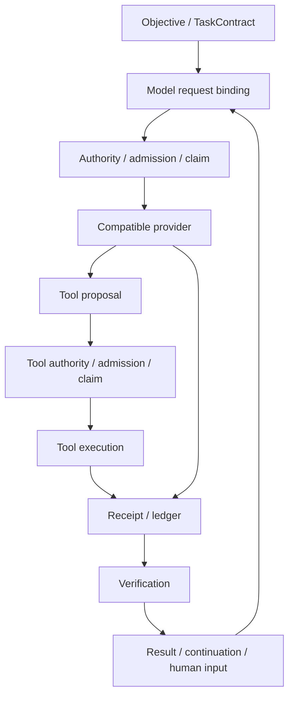

# Lattice Harness

A local, task-oriented agent harness with real tools, durable execution records,
and explicit verification. **Experimental prerelease · 0.0.0 · MIT.**

An agent harness connects a model to a controlled execution loop. Lattice keeps
an objective, an authority contract and evidence around that loop: which request
was sent, which effect was admitted, what actually ran, what remains uncertain,
and why the task can finish or needs human input. Its tools change files and run
processes; the conversation is one view of that work.

[Install](#installation) · [First task](#first-task) · [Português](#primeiro-uso-em-português)
· [Architecture](#architecture) · [Security](SECURITY.md) · [Contributing](#development)

## Current capabilities

- Tasks with an original objective, acceptance criteria, workspace and optional limits.
- Path/text search, bounded file reads and expansion, version-checked edits.
- Explicit argv or shell execution; supervised process polling, input, stop and waiting.
- Admission → claim → receipt for effects, request binding and durable SQLite ledgers.
- Observed usage accounting, uncertain reservations and `UNKNOWN` effects.
- Proportional verification: a directory/file observation, recognized passing tests,
  or an analysis response, according to the task contract.
- Durable history and eligible continuation under the existing contract and budget.
- OpenAI-compatible provider configuration, model discovery/manual IDs, guidance and
  model switching. Active and pending selections are distinct.
- A web UI and an Electron desktop shell with a native project chooser.
- A context-window indicator tied to actual provider metadata and observed input.
- Structured directory inventories with pagination and verified, persistent results.
- Full final model responses, labeled separately from runtime-verified results.

There is one execution engine. MCP, subagents, semantic memory, a universal planner
and a general prompt-injection defense are not current capabilities. The retired
Agent Index/Plow integration is absent from the active product.

## Installation

### Source checkout — publicly reproducible route

Requires **Node.js >=22.13.0**, npm, and Git for cloning. A browser is needed for the
web UI; project commands require their own toolchains. SQLite comes from Node.

```sh
git clone https://github.com/Elliot509/LatticeHarness-Candidate.git
cd LatticeHarness-Candidate
npm ci --ignore-scripts
npm run build
node dist/cli/main.js ui --workspace /path/to/disposable-project
```

Create the project directory first. The command prints a local address; open it
in your browser. `--ignore-scripts` avoids downloading Electron during this
web/CLI setup. It does not install an Electron runtime. Only run tasks against
projects and commands you trust.

The current source was tested on the maintainer's Archcraft Linux x64 host with
Node 26.10.0 and a pinned Electron 44.5.1 runtime. Node 24.19.0 has an additional
local verification check. The exact 22.13.0 floor has a runtime gate and CI matrix,
but was not available for a fresh local run; that is a validation gap.

### Local npm artifact — CLI and web UI

There is no registry installation claim. From a built checkout, `npm pack`
creates a small local package. Pack/install tests exercise an isolated global
prefix, `npm exec`, the installed CLI/UI, a real code-edit/test fixture and a
v1→v3 SQLite migration. `desktop/PORTABLE.md` is included in this package.

The npm package contains compiled application code and documentation. It
**does not include the Electron runtime** and is distinct from a portable desktop
application. It is not a download from a published npm release.

### Electron desktop — runtime included in a portable bundle

A complete portable bundle contains the application, compiled UI/backend and a
pinned Electron runtime. It needs a graphical desktop and compatible system
libraries, but no system Node, npm, Git or Python to open Lattice. Commands in
your selected project may still need those programs.

**No public portable binary, signed installer or GitHub release is offered for
this revision.** A maintainer has validated a new Linux x64 bundle locally; a
private local path is not a public download. Use the source route above until a
separately qualified artifact is actually distributed.

| Platform | Current status | Portable launch route, when a qualified bundle is supplied |
|---|---|---|
| Arch / Archcraft Linux x64 | Native engineering test on the current host; no formal distribution support claim. | Extract the entire bundle and run `./lattice-p0` as a normal desktop user. |
| Ubuntu 24.04 x64 | New artifact not tested in a guest in this sprint. | See [portable instructions](desktop/PORTABLE.md), including the conditional sandbox setup. |
| Windows 11 x64 | New artifact not tested on Windows in this sprint. | A qualified complete ZIP would use `Lattice.vbs` with its adjacent `app` directory. |

Keep an old installation until the alternative is validated. Close it before
opening another instance on the same data directory. No automatic menu replacement,
data cleanup or profile migration is part of these instructions. The exact local
bundle and isolated launch instructions are delivered separately to its owner.

## First task

1. Open the web UI or a qualified desktop bundle. Choose a **disposable project**;
   desktop uses **Pasta / Escolher projeto**, web mode stays inside its served root.
2. Open **Modelo / Configurar** and choose **OpenRouter**. Confirm the endpoint.
3. Enter your key directly in **Chave de API da sessão**, then **Configurar chave**.
   The field clears; the backend retains it for this provider/endpoint session.
   Never put a key in chat, an objective, an endpoint URL or a project file.
4. Discover models if supported, or enter the exact model ID your account exposes.
   Choose **Usar este modelo**. No Muse ID, availability, price or XHIGH option is
   assumed; discovery alone does not prove successful inference.
5. Start with an absent target and this objective:

   > Crie uma pasta chamada TesteMuse dentro deste projeto e confirme que ela existe.

6. For this recognized, simple creation request, leave the optional criterion
   blank: Lattice derives `directory-exists:TesteMuse` and checks the filesystem.
   To specify it yourself, expand **Critério de conclusão opcional** and enter
   that criterion. Explicit criteria take precedence; ambiguous or compound
   creation requests need an explicit target/criterion instead of silently
   discarding additional work. Optional call and cumulative token limits are
   separate controls.
7. Start the task. Inspect the original objective, tool activity, output and
   acceptance result. Expect the target directory to exist and state **Concluído**
   (`COMPLETED`); command exit 0 or the model saying “done” alone is insufficient.
8. Close and reopen to inspect retained history. Reenter the key for a new session.
   **Interromper** cancels work; it must not be interpreted as successful completion.

The selected project also resolves local expressions such as `dentro deste
ambiente`. After completion, **Enviar nova tarefa** creates a separate task in
that project with the selected provider/model and configured limits. It does not
send the previous conversation or inherit its acceptance criteria. Tool activity
can be expanded to inspect arguments and captured results; successful execution
groups are collapsed after verified completion.

Local fixtures exercise tool use and verification without paid inference. A
human-run OpenRouter trial with `meta/muse-spark-1.3-contributor` successfully
completed the objective `Crie uma pasta chamada "Python" dentro desse lugar.`:
one model call, the directory created, and `directory-exists:Python` satisfied,
without the previous loop. This is one successful real trial, not a general
certification of Muse quality, reliability or availability. No additional paid
inference is needed for the regression suite. If an effect is `UNKNOWN`, inspect
it before retrying.

## Primeiro uso em português

A rota de código-fonte acima exige Node/npm; o aplicativo portátil completo inclui
seu runtime. No aplicativo novo: escolha uma pasta descartável, configure
OpenRouter, insira a chave somente no campo local e selecione o ID exato do modelo
Muse disponível na sua conta. Copie a tarefa e o critério do tutorial acima.
Veja as ferramentas e a verificação antes de considerar **Concluído** um sucesso.
O histórico persiste; a chave de sessão não. Houve um ensaio real bem-sucedido
com `meta/muse-spark-1.3-contributor` pelo OpenRouter: uma chamada, pasta `Python`
criada e critério satisfeito, sem looping. Isso não certifica o modelo em geral.
Windows/Ubuntu continuam exigindo suas próprias validações do aplicativo nativo.
Não há link de binário público nesta revisão.

## Architecture


```mermaid
flowchart TD
    O[Objective / TaskContract] --> B[Model request binding]
    B --> A[Authority / admission / claim]
    A --> P[Compatible provider]
    P --> T[Tool proposal]
    T --> G[Tool authority / admission / claim]
    G --> X[Tool execution]
    X --> R[Receipt / ledger]
    P --> R
    R --> V[Verification]
    V --> C[Result / continuation / human input]
    C --> B
```

The contract carries scope, grants, prohibitions, obligations and acceptance.
A physical attempt has an identity and durable receipt; provider/model/endpoint
are bound to the admitted request. SQLite stores sessions, runs, events, effects
and usage. Context keeps the objective/authority and bounded recent observations;
older evidence stays in durable records. This is bounded text context, not a
promise about every provider's token window or native tool-conversation format.

The Electron main process owns window/project/lifecycle operations. A utility
process runs the same backend/runtime as the web/CLI routes. The renderer uses
a narrow preload bridge and authenticated HTTP/SSE; it does not run a separate
agent engine.

### Verification and large projects

- Recognized single directory/file creation requests can derive a filesystem
  criterion automatically. Explicit criteria are preserved; ambiguous or compound
  creation requests ask for clarification. A satisfied filesystem criterion can
  finish after tool execution without another model call or TAP/Node test counts.
- `directory-exists:path` / `file-exists:path`: inspect the actual contained target,
  including a preexisting target; no TAP requirement for directory creation.
- `tests-pass`: recognized TAP or Node test summary, a clean exit, and matching
  content observations before/after execution and at completion. At least one
  passing test is required. Later edits invalidate the evidence.
- `response`: an analysis answer; it certifies no filesystem correctness. An
  explicit `response` criterion remains an answer-only obligation even after
  exec/edit; add filesystem/test criteria when those effects must be certified.

Recognized local inventory requests, such as `Me liste tudo que está nessa
pasta.`, use `read` with `kind: "directory"`. Immediate children are the default;
recursion must be requested. Hidden/generated entries are included, and symbolic
links are listed without following their destinations. Every page must be
retrieved before the runtime delivers a verified complete list. The metadata
scan is bounded to 10,000 entries, about 2 MiB and at most five seconds; an
incomplete scan cannot certify completeness. Cursors continue the original
observation, not a fresh or atomic filesystem snapshot. Captured command output
can also be expanded without rerunning the command, but bytes omitted by the
executor cannot be recovered.

The whole-project test-content verifier streams content asynchronously in 64 KiB
buffers. Unlike directory inventory scans, it has no 32 MiB or 10,000-entry
cutoff. Path, type, mode, size and content digest have
unambiguous framing. Read/search observations do not rescan the whole project.
Progress detection uses observed tool results/versions and confirmed edits;
unrelated filesystem activity is not proof of productive work.

Content evidence excludes `.git`, `node_modules`, `dist` and `.cache` directories;
symlink destinations, dependencies, external services and the runner environment
are outside that proof. This is not an atomic filesystem snapshot or a guarantee
against a malicious concurrent writer. A changing/unreadable entry or a 30-second
observation deadline produces **unknown evidence**, never a positive verification.
Use a quiet, bounded project and rerun tests; an explicit target criterion can
verify a smaller filesystem task without pretending that whole-project tests
were certified. Commands that generate source-visible artifacts may require a
fresh run after those artifacts settle. Tests are not proof of their own quality
or resistance to intentional modification.

### Context indicator

The main bar shows `Contexto: used / window (%)`. Capacity comes from the real
provider's model metadata, such as `context_length`, bound to the effective
provider, endpoint and model. If only a nominal model capacity is supplied,
that is the capacity displayed; no effective route limit is invented.

Usage is the observed input of the latest confirmed, completed matching call
(`usage.prompt_tokens` where supplied), including cached input once. It is not
cumulative task usage, output tokens or a reservation. Model/endpoint changes
update the binding and capacity; confirmed values survive task reopening.
Missing or unreliable values show `—`, and a cancelled/unknown call does not
replace confirmed input. Displayed compact numbers and percentages are rounded;
exact counts are available in the indicator tooltip. Metadata lookup makes no
inference call. Accumulated accounting remains available under **Diagnóstico**.

## Limits, security and privacy

New tasks have **no implicit cumulative limit of 50 calls or 200,000 tokens**, and
no default contract expiry. Optional user caps, request/command timeouts,
authorization, human cancellation and lack-of-progress detection remain active.
Observed usage is settled even above its reservation estimate; true configured
exhaustion prevents further effects. Partial/missing usage keeps uncertainty and
reservation. A reserve is an estimate, not a dollar-spend ceiling.

Tools run in a **local-trusted** realm with your user privileges. Workspace checks,
environment filtering and Electron renderer isolation do not sandbox arbitrary
commands at the OS level. Free-text prohibitions are guidance; typed restrictions
are the enforced policy. There is no universal protection against malicious code,
prompt injection or a hostile process already running as your user.

Provider keys live in backend session memory, scoped to provider/normalized
endpoint; no durable key store is supplied. History/nonsecret defaults persist
locally. Desktop uses `${XDG_DATA_HOME:-~/.local/share}/lattice` on Linux and
`%LOCALAPPDATA%\Lattice` on Windows, including its browser profile. Keep those data
when replacing application binaries if you want to retain history.

Uncertain effects prevent blind retry and success claims. Resume does not renew
budget/authority or adopt orphan processes. Ownership/migration concurrency,
retention/scale, general late-usage reconciliation, external writers, detached
processes, lost acknowledgments and some accessibility behavior need further
hardening. Historical data is not silently repaired. See [SECURITY.md](SECURITY.md)
for the current boundary and private vulnerability-reporting route.

The Electron backend uses system-selected address connection behavior to avoid
an observed embedded-Node automatic address-family connection failure. TLS and
uncertain-request handling remain enabled; this is not an inference retry.
Terminal state updates refresh the UI's resume gate so a stale `active-runtime`
notice does not hide the actual uncertainty blocker.

Known workflow limitations remain: guidance stored on a pre-inference
`clarification-required` task does not resolve its criterion or restart it;
create a new task with a clear objective or explicit criterion. Snapshots display
the newest 500 chat messages, while older events remain in the ledger. LB-01
(Composer reported disabled after `COMPLETED` in an educational campaign) is not
considered closed: deterministic follow-up tests pass, but the reported campaign
behavior still needs reconciliation. Real educational trials demonstrated
reading, explanations and persistence; complex Python correction and material
organization failed in that campaign. These capabilities are not guaranteed.

## Development

TypeScript/Node SQLite power the runtime/backend; React and esbuild build the UI;
Electron provides the desktop shell; Vitest and native Chromium tests verify it.

| Directory | Responsibility |
|---|---|
| `src/runtime`, `src/context` | Contracts, effects, acceptance, accounting, loop and context |
| `src/tools`, `src/providers` | Local tools and compatible model adapters |
| `src/storage`, `src/server` | SQLite persistence and authenticated HTTP/SSE |
| `src/ui`, `src/desktop` | React interface and Electron shell/backend bridge |
| `tests`, `fixtures`, `scripts` | Regression fixtures, builds and package checks |

```sh
npm run typecheck
npm run lint
npm run build
npm test
npm run pack:test
```

Browser tests require a usable Chromium executable; unavailable/skipped tests
cannot qualify browser behavior. Fixtures exercise real effects with synthetic
model responses. Native Electron and exact portable artifacts require separate
checks; npm pack does not prove either. CI includes Node 22.13.0/24.x on Linux
and Windows; a configured matrix is not a claim that every run passed.

Contributions should identify the behavior, regression and evidence; preserve
unrelated work and exclude keys, local databases, logs, profiles and operator
material. Propose independent changes separately. Licensed under [MIT](LICENSE);
Electron's bundled upstream notices accompany its runtime in portable artifacts.
